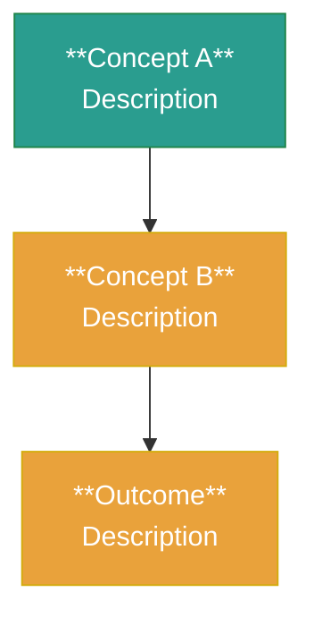

# Archive Skill

General-purpose content archiving into Obsidian vault. Detects content type, preserves original text, produces structured notes.

---

## Core Rules (Non-Negotiable)

1. **Verbatim preservation** — NEVER summarize, compress, or paraphrase original content unless explicitly asked.
2. **Duplicate check first** — Before archiving, search vault with `Glob`/`Grep` for matching content. If exists, inform user and skip.
3. **Mermaid over SVG** — Use Mermaid diagrams for framework visualizations (native Obsidian rendering). Do NOT generate SVG files.
4. **Frontmatter required** — Every note must have: `title`, `date`, `source`, `type`, `tags`, `status`.

---

## Step 1: Detect Content Type

Identify the input source and route accordingly:

| Input Type | Detection Signal | Action |
|---|---|---|
| **Conversation log** | `**You said**` / `**ChatGPT said**` / `**Human**` / `**Assistant**` | Route to `/conversation-archive` skill |
| **Xiaohongshu URL** | `xiaohongshu.com` or `xhslink.com` in URL | Handle CSR limitation (see Step 2a) |
| **Web article URL** | Any other HTTP/HTTPS URL | Fetch + restructure (see Step 2b) |
| **Pasted text** | No URL, raw text provided by user | Direct processing (see Step 2c) |
| **Local file** | File path provided | Read + process (see Step 2d) |

**If conversation log detected:** Tell user "呢個係對話記錄，我幫你轉去 `/conversation-archive` 處理" and invoke that skill. Stop here.

---

## Step 2: Acquire Content

### 2a. Xiaohongshu (Client-Side Rendered)

Xiaohongshu pages are client-side rendered. `WebFetch` / `curl` will return incomplete content (only metadata, no body text).

**Do NOT attempt to fetch.** Instead:
1. Check vault for existing transcript: `Grep` for keywords from the URL or title
2. If found → use existing content, skip to Step 3
3. If not found → ask user:
   > 小紅書係 CSR 頁面，我冇辦法直接抓取內容。你可以：
   > A. 貼上文章全文
   > B. 如果有影片文字稿，貼上文字稿
   > C. 提供已保存嘅本地檔案路徑

### 2b. Web Article

1. Run `WebFetch` with prompt: "Extract the full article text, preserving all paragraphs, headings, lists, code blocks, and tables. Do not summarize."
2. If content is incomplete (<200 chars or mostly metadata), inform user and ask them to paste content
3. Preserve the fetched structure for Step 3

### 2c. Pasted Text

Use the text as-is. Ask user for:
- Source URL (if available)
- Content type (article / transcript / notes / other)

### 2d. Local File

1. Read the file with `Read` tool
2. Detect format from content structure
3. Proceed to Step 3

---

## Step 3: Generate Note

### Metadata Extraction

From the content, determine:
- **title**: Descriptive English title, dash-separated (e.g., `Xiaohongshu-PKM-Workflow-Tips`)
- **date**: Today's date (YYYY-MM-DD)
- **source**: URL if available, or "pasted text" / "local file"
- **type**: `article` / `transcript` / `notes` / `video-transcript`
- **tags**: 5-15 relevant terms extracted from content
- **status**: `raw` (default)

### Note Structure

```markdown
---
title: [Title]
date: [YYYY-MM-DD]
source: [URL or description]
type: [article/transcript/notes]
tags: [tag1, tag2, ...]
status: raw
---

# [Title]

> [!abstract] 摘要
> [One-paragraph summary written by Claude — NOT from original text]

[Full original content, preserved verbatim]

---

## 框架圖

[Mermaid flowchart if content has a conceptual framework — skip for simple articles]

## 關鍵概念

| 概念 | 說明 |
|------|------|
| **Term** | One-sentence definition from context |

## 行動項

- [ ] [Action item extracted from content]
```

### Rules for Content Section

- Preserve ALL original paragraphs, lists, code blocks, tables
- Use `> [!quote]` for direct quotes from the source
- Use `####` for sub-headings within the content if the original has them
- If original has images, note their position with `[圖片: description]` placeholder
- Do NOT add commentary inline — keep original text pure

### Mermaid Diagram (Optional)

Only generate if the content presents a conceptual framework, process, or system. Skip for:
- Simple Q&A
- News/report content
- Lists without conceptual relationships

If generating:


---

## Step 4: Write and Verify

1. Write the note to vault root: `/Users/troia/Obsidian/haku & troia (⁎⁍̴̛ᴗ⁍̴̛⁎)💗/[Title-Slug].md`
2. Verify: run `wc -l` on output — should be ≥ source line count
3. Verify: spot-check first and last paragraphs appear in output
4. Report to user:
   > 歸檔完成：`[Title-Slug].md`
   > - 來源：[source]
   > - 行數：[line count]
   > - 標籤：[tag1, tag2, ...]

---

## Error Handling

| Error | Action |
|---|---|
| WebFetch returns incomplete content | Ask user to paste full text |
| Duplicate note found in vault | Inform user, ask if they want to update existing note |
| Content has no clear structure | Use simplified format (no Mermaid, fewer metadata fields) |
| Content is very short (<20 lines) | Suggest creating a simple note instead of full archive |
| Content is very long (>2000 lines) | Process in sections, confirm with user before writing |

---

## Changelog

### v1.0.0 (2026-06-07)
- Initial release
- Content type routing (conversation → /conversation-archive, others → self)
- Xiaohongshu CSR handling with paste fallback
- Verbatim preservation enforcement
- Mermaid-first diagram policy
- Duplicate vault check before archiving
