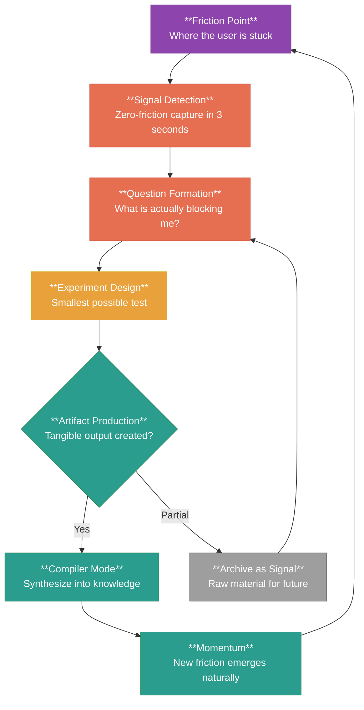

# Conversation Archive Skill

Transform raw AI conversation logs into structured, vault-ready Obsidian research notes.

## Core Principle

> **All original conversation text MUST be preserved in the output.**
> You may add emphasis (**bold**), callouts (`> [!type]`), section headers, and structural annotations.
> You may NOT delete, paraphrase, summarize, or rephrase any original line from the conversation.
> If the original has Strategy Cards with empty fields — preserve the empty fields with a note.

---

## Input Detection

The skill activates when:
1. The user is viewing a conversation log (Clippings/, or any file with `**You said**` / `**ChatGPT said**` / `**Assistant**` pattern)
2. OR the user explicitly asks to archive/organize/format a conversation
3. AND the conversation contains substantial analytical content (frameworks, models, theories — not just Q&A)

If the file is a simple Q&A without theoretical depth, suggest using `web-to-obsidian-note` instead.

---

## Workflow

### Step 1: Scan Source + Read Template (parallel)

Launch two reads in parallel:
1. **Source conversation** — read the full clipping/note
2. **SVG template** — read [references/SVG-TEMPLATE.md](references/SVG-TEMPLATE.md)

From the source, identify:
- All conversation turns: `**You said**` / `**ChatGPT said**` or equivalent
- Content structure: user statements, AI analysis, interactive elements (Strategy Cards, code blocks, ASCII diagrams, tables)
- Total line count — determines note scale and whether to use simplified assembly (Step 9)
- **Natural topic shifts** — where does the conversation pivot to a new subject? These become chapter breaks

### Step 2: Extract Metadata + Identify Framework (merged)

These two steps are done together — the framework analysis informs metadata extraction.

**Metadata fields:**
- **title**: Core topic of the conversation (English, descriptive, dash-separated)
- **date**: Today's date (YYYY-MM-DD)
- **tags**: All theoretical terms, names, and topics mentioned (8-20 tags)
- **status**: `raw-synthesis` (default) or `draft` if user indicates refinement
- **type**: `conversation-log`
- **source**: URL if available from the clipping's frontmatter
- **related**: Wikilinks to related notes that may exist or should exist in the vault

**Framework analysis:**
- What is the **starting observation/friction**?
- What **patterns** were detected?
- What **structural shifts** or **framework extractions** occurred?
- Are there **dual mechanisms** (parallel concepts)?
- What are the **outcomes** (positive path vs. negative path)?
- What is the **core thesis** (one sentence)?

These nodes feed into both the SVG and Mermaid diagrams.

### Step 3: Generate SVG Framework Diagram

Create a standalone `.svg` file in `assets/` following the template in [references/SVG-TEMPLATE.md](references/SVG-TEMPLATE.md).

Requirements:
- **Color coding by semantic layer** (see color palette in template)
- **Top-down flow** — primarily single-direction, but **two fork points are allowed** when the framework has a main fork (parallel mechanisms) AND a terminal fork (positive vs. negative outcomes)
- **Two terminal outcomes** at bottom (negative = gray, positive = teal)
- **Core thesis** at the bottom in a bordered pill
- **All text in English**, preserving academic terminology
- Title: derived from conversation topic
- Subtitle: `Developed across conversation · [DATE]`

**Adapt the SVG structure to match the conversation's actual framework shape:**
- Progressive evolution (linear chain) → use sequential layers
- Dual-mechanism framework → use one fork point
- Progressive + outcome fork → use main flow + terminal fork (two fork points)
- Complex branching → use multiple convergence points

Save as: `assets/[Title-Slug]-Framework.svg`
Embed in note with: `![[assets/[Title-Slug]-Framework.svg]]`

### Step 4: Organize Into Chapters

Structure the note following the **natural topic shifts** of the conversation. Each chapter represents a distinct conceptual phase.

**Chapter title strategy** (choose based on conversation style):
- **Use AI's original headers** when the AI response already has clear section headers (e.g., `### Claude Code 可以變成你嘅 AI Lab`) — these are often better than generated titles
- **Derive from topic shift** when the AI response has no clear headers, or when multiple turns are grouped into one chapter

**Chapter content structure — flexible format:**

For short exchanges (1-2 turns per chapter):
```markdown
## 第 N 章｜[Chapter Title]

### Troia 講嘅 (or: User's Original Statement)

> [Exact original quote from the user]

### Claude 分析嘅 (or: AI Analysis)

[Complete, verbatim AI analysis text]

> [!important] 核心命題
> [Key insight from this section]
```

For long AI responses with internal structure (multiple sections, headers, examples):
```markdown
## 第 N 章｜[Chapter Title — often the AI's first section header]

### Troia 講嘅

> [Exact original quote from the user]

### Claude 分析嘅

#### [AI's Original Section Header 1]

[Verbatim content]

#### [AI's Original Section Header 2]

[Verbatim content]

...
```

**Rules:**
- User quotes use blockquote (`>`) format
- AI analysis is preserved verbatim — **every paragraph, every code block, every list item**
- Code blocks (ASCII workflows, technical examples) are preserved in fenced code blocks
- Tables are preserved in markdown table format
- **Strategy Cards are preserved inline within their parent chapter** (not as separate sections) — they naturally belong to the AI response that generated them
- Use `####` for AI's original sub-headers to maintain hierarchy under the `##` chapter heading
- If a chapter spans a full AI response that IS the content (e.g., a complete system prompt), preserve the entire response as a single block with its internal headers demoted one level

### Step 5: Generate Mermaid Flowchart

Create a `flowchart TD` Mermaid diagram that mirrors the SVG structure.

Requirements:
- Format: `flowchart TD`
- Each node: **bold title** + `<br/>` + one-sentence explanation
- Arrows for causal/extension/fork relationships
- Match the SVG's fork structure (one or two fork points, as determined in Step 3)
- Two outputs at bottom: negative result, positive path
- Dashed arrows (`-.->`) for "potential path" or "antithesis" relationships
- Color classDefs:
  - `purple` (theoretical root): `fill:#8E44AD,stroke:#7D3C98,color:#fff`
  - `coral` (structural shift): `fill:#E76F51,stroke:#CB4335,color:#fff`
  - `amber` (mechanism): `fill:#E9A23B,stroke:#D4AC0D,color:#fff`
  - `teal` (synthesis/positive): `fill:#2A9D8F,stroke:#1E8449,color:#fff`
  - `gray` (negative outcome): `fill:#9E9E9E,stroke:#757575,color:#fff`
- All text in English, academic terminology

### Step 6: Build Terminology Index

Extract all key theoretical terms from the conversation and present as a table:

```markdown
| 術語 | 來源 | 在此框架嘅位置 |
|------|------|----------------|
| **Term** | Origin Field | Role in framework |
```

Include 10-20 terms. Each row: bold term, its field of origin (e.g., "Product Strategy", "Cognitive Science"), and its role in the conversation's framework (one sentence).

### Step 7: Extract Research Actions

Pull all open questions, unresolved threads, and "what if" statements from the conversation.

Format as checkboxes:

```markdown
- [ ] [Question or action item]
```

Aim for 8-15 items. Include the theoretical term in **bold** where relevant.

### Step 8: Assemble Final Note

Combine all components in this order:

1. **Frontmatter** (YAML)
2. **Title** (H1)
3. **Core Thesis callout** (`> [!abstract]`)
4. **Framework Diagram** (SVG embed)
5. **Chapters** (organized by conversation flow, ALL original text preserved, Strategy Cards inline)
6. **Mermaid Flowchart** (newly generated, in its own section after chapters)
7. **Terminology Index** (table)
8. **Research Actions** (checkboxes)
9. **元觀察** (meta-observation callout — one paragraph on how this note itself demonstrates the framework)

**Note:** If the conversation has no substantial framework (simple Q&A), skip SVG and Mermaid, and simplify to chapters + terminology only.

### Step 9: Verify Completeness

After writing the output files, verify by running:
1. `wc -l` on both source and output — output should be ≥ source line count (added structure = more lines)
2. `ls -la` on the SVG asset — confirm it exists and is non-empty
3. Spot-check: the first and last conversation turns from source must appear in the output

---

## Output File Naming

- Main note: `[Title-Slug].md` in vault root
- SVG asset: `assets/[Title-Slug]-Framework.svg`

Title slug rules:
- English, descriptive
- Dashes over spaces
- No special characters beyond dashes and parentheses
- Example: `Cold-Start-OS-From-Friction-to-Momentum`

---

## Examples of Valid Input Sources

| Source | Format | Detection |
|--------|--------|-----------|
| ChatGPT web export | `**You said**` / `**ChatGPT said**` | Pattern match |
| Claude.ai export | `**Human**` / `**Assistant**` | Pattern match |
| Obsidian Clippings | YAML frontmatter with `source:` URL | Frontmatter field |
| Raw paste | Mixed format with speaker labels | Flexible detection |

---

## Integration
- Use `/humanizer` to polish archived text if it shows AI writing patterns

## Error Handling

- **No conversation turns detected**: Ask user to confirm the file contains a conversation, or specify which file to process
- **Conversation too short** (<20 lines of analysis): Suggest using a simpler note format; offer to create a standard note instead
- **No theoretical framework**: Skip SVG generation; generate a simpler Mermaid mindmap instead
- **Multiple conversations in one file**: Ask user which conversation to process, or process all with separate notes

---

## Good Output Examples

### Example 1: ChatGPT Conversation Archive (Full Structure)

The skill takes a raw ChatGPT export and produces a structured Obsidian note with all components:

**Input:** A 200-line ChatGPT conversation about building a personal knowledge management system.

**Output files:**
- `Cold-Start-OS-From-Friction-to-Momentum.md` (main note)
- `assets/Cold-Start-OS-From-Friction-to-Momentum-Framework.svg` (framework diagram)

**Main note structure:**

```yaml
---
title: Cold-Start-OS-From-Friction-to-Momentum
date: 2026-06-07
tags: [cold-start, knowledge-management, PKM, friction, momentum, artifact-loop, signal-detection, compiler-mode, workflow-design, cognitive-load, pattern-recognition, iterative-refinement]
status: raw-synthesis
type: conversation-log
source: https://chat.openai.com/share/example123
related: "[[Artifact-Loop-Theory]]", "[[Signal-vs-Noise-Framework]]"
---
```

```markdown
# Cold-Start OS: From Friction to Momentum

> [!abstract] 核心命題
> A personal knowledge system that requires motivation to operate is already broken. The Cold-Start OS replaces motivation with friction detection — find where you're stuck, extract one signal, turn it into a tangible artifact, and let momentum build from there.

![[assets/Cold-Start-OS-From-Friction-to-Momentum-Framework.svg]]

## 第 1 章｜The Problem with Goal-Driven PKM

### Troia 講嘅

> Every productivity system I've tried assumes I know what I want. But the real problem is that I don't know what I want until I've already started doing something. Goals are retrospective, not prospective.

### Claude 分析嘅

This is a fundamental misalignment between how PKM systems are designed and how creative cognition actually works. Most systems impose a goal-first architecture:

```
Goal → Plan → Execute → Review
```

But your experience suggests a different pattern:

```
Friction → Signal → Artifact → Reflection → New Friction
```

> [!important] 核心命題
> Goals are retrospective narratives imposed on a process that was actually driven by friction and偶然發現.

## 第 2 章｜Signal Detection in Practice

### Troia 講嘅

> So how do I actually notice friction without turning it into another productivity task?

### Claude 分析嘅

The trap is meta-work — spending more time designing the system than using it. Signal detection must be zero-friction:

#### The 3-Second Rule
If it takes more than 3 seconds to capture a signal, you won't do it. The capture mechanism must be:
- Always available (terminal, phone, voice)
- Zero-categorization (no folders, no tags at capture time)
- One-action (type → done)

#### Post-Capture Processing
Categorization happens later, in batch, when you're already in compiler mode. This separates the creative act (noticing) from the organizational act (sorting).

> [!tip] 實踐提示
> 好嘅 PKM 唔係令你更勤力，而係令你更懶得有道理。

---



## 術語表

| 術語 | 來源 | 在此框架嘅位置 |
|------|------|----------------|
| **Cold Start** | Startup terminology | 系統嘅起點——無動力、無方向，只有 friction |
| **Signal Detection** | Cognitive science | 從 friction 中提取一個可操作嘅觀察 |
| **Artifact Loop** | Maker culture | 核心循環：signal → question → experiment → artifact |
| **Compiler Mode** | Software engineering | 將 raw material 合成為結構化知識嘅狀態 |
| **Knowledge Moat** | Business strategy | 累積嘅 artifacts 形成嘅個人知識護城河 |
| **Friction Point** | UX design | 用戶卡住嘅地方，即係 signal 嘅來源 |
| **Zero-Friction Capture** | Product design | 3 秒內完成嘅信號捕捉機制 |
| **Meta-Work** | Productivity critique | 花喺設計系統而非使用系統嘅時間 |

## 研究行動

- [ ] 實測 **3-second rule**：用 terminal alias 做 one-action capture
- [ ] 設計一個 **artifact template** 令每次產出更快
- [ ] 整理過去一個月嘅 **friction points**，睇下有冇 pattern
- [ ] 研究 Karatani 嘅 **mode of exchange** 點樣對應 artifact 嘅流通
- [ ] 試下 **batch categorization** 每週一次，唔好即場分類
- [ ] 搵出自己最容易 **meta-work** 嘅場景
- [ ] 設計一個 **compiler mode trigger**（環境/時間/儀式）
- [ ] 測試 **archive vs. loop** 嘅判斷標準：幾時放棄、幾時繼續

> [!note] 元觀察
> 呢個 note 本身就係一個 artifact loop 嘅示範——由一個 friction（「點解我嘅 PKM 唔 work」）出發，經過 signal detection（呢個對話）、experiment（整理成結構化筆記），產出一個具體 artifact（呢個 note）。下一步係將呢個模式 repeat。
```

### Example 2: Claude Transcript Archive (Simplified)

**Input:** A shorter Claude.ai conversation (80 lines) about Excalidraw diagram design principles.

**Output:** Note with chapters but no SVG (framework is too simple for a diagram). Mermaid uses a mindmap instead.

```yaml
---
title: Excalidraw-Diagram-Design-Principles
date: 2026-06-07
tags: [excalidraw, diagram-design, visual-thinking, information-architecture, layout, visual-hierarchy]
status: raw-synthesis
type: conversation-log
---
```

```markdown
# Excalidraw Diagram Design Principles

> [!abstract] 核心命題
> 好嘅 diagram 唔係將資訊攤平，而係用空間關係講因果故事。

## 第 1 章｜Why Most Diagrams Fail

### Troia 講嘅

> I keep making diagrams that look organized but nobody understands. What am I doing wrong?

### Claude 分析嘅

The most common diagram failure is **spatial dishonesty** — placing items side by side when the relationship is actually causal, hierarchical, or temporal. Your brain reads spatial position as meaning:

- Left-to-right = sequence or flow
- Top-to-bottom = hierarchy or importance
- Proximity = relatedness
- Alignment = equivalence

When your layout violates these conventions, readers work harder to parse the same information.

> [!important] 核心命題
> Diagram 係用空間講故事。位置唔單止係排版，而係語義。

## 第 2 章｜The Three Layout Patterns

### Troia 講嘅

> So what are the actual patterns I should follow?

### Claude 分析嘅

Every diagram is one of three patterns (or a combination):

#### 1. Flow (Sequential)
Use when: A leads to B leads to C
Layout: Left-to-right or top-to-bottom, single path
Example: User journey, pipeline, process

#### 2. Hub (Relational)
Use when: One concept connects to many
Layout: Central node with radiating connections
Example: Architecture overview, concept map

#### 3. Matrix (Comparative)
Use when: Multiple dimensions need simultaneous comparison
Layout: Grid with consistent axes
Example: Feature comparison, framework evaluation

> [!tip] 實踐提示
> 開始畫 diagram 之前，問自己一個問題：「呢個資訊最自然嘅空間關係係咩？」答案就係你嘅 layout pattern。

## 術語表

| 術語 | 來源 | 在此框架嘅位置 |
|------|------|----------------|
| **Spatial Dishonesty** | Information design | 布局同實際關係矛盾 |
| **Visual Hierarchy** | Graphic design | 用大小/顏色/位置表達重要性 |
| **Flow Pattern** | Process design | 順序關係嘅空間表達 |
| **Hub Pattern** | Network theory | 中心輻射式關係 |
| **Matrix Pattern** | Comparison frameworks | 多維度同時比較 |

## 研究行動

- [ ] 用 **flow pattern** 重新畫一個之前做錯嘅 diagram
- [ ] 測試 **hub pattern** 用喺 architecture overview
- [ ] 收集 3 個好嘅 diagram examples 做 reference

> [!note] 元觀察
> 呢個對話本身就係一個 hub pattern——一個核心問題（「點解我嘅 diagram 唔 work」）輻射出三個解法（flow / hub / matrix）。
```

### Example 3: Short Conversation (Edge Case)

**Input:** A 30-line ChatGPT Q&A about whether to use Notion or Obsidian for PKM. No deep framework — mostly opinion exchange.

**Output:** Simplified note — no SVG, no Mermaid, chapters only, terminology table skipped (not enough terms).

```yaml
---
title: Notion-vs-Obsidian-for-PKM
date: 2026-06-07
tags: [notion, obsidian, PKM, tool-selection, local-first]
status: raw-synthesis
type: conversation-log
---
```

```markdown
# Notion vs. Obsidian for PKM

> [!abstract] 核心命題
> Notion 適合團隊協作，Obsidian 適合個人知識累積。選擇取決於你係「同人分享」定「自己用」。

## 第 1 章｜The Core Trade-off

### Troia 講嘅

> Should I use Notion or Obsidian for my personal knowledge base?

### Claude 分析嘅

The decision comes down to one question: **Is your knowledge base a publishing platform or a thinking tool?**

- **Notion** excels at structured databases, team collaboration, and polished sharing. It's a publishing platform that happens to store notes.
- **Obsidian** excels at linked thinking, local-first ownership, and extensibility. It's a thinking tool that happens to produce documents.

If you're building a team wiki → Notion.
If you're building a personal knowledge moat → Obsidian.

> [!important] 核心命題
> 唔係邊個更好，而係你嘅 use case 需要 publishing 還是 thinking。

## 第 2 章｜The Lock-in Question

### Troia 講嘅

> What about data lock-in? I don't want to lose everything if the company shuts down.

### Claude 分析嘅

Notion stores data in proprietary format on their servers. Export is markdown but loses databases, relations, and rollups. You're renting, not owning.

Obsidian stores plain markdown files on your local disk. You own the files. Any text editor can open them. Zero lock-in by design.

> [!tip] 實踐提示
> 如果 data ownership 對你好重要，答案已經出咗。

## 研究行動

- [ ] 試用 Obsidian 一週，測試 **wikilink** 工作流
- [ ] 評估現有 Notion 數據庫可否遷移
```

---

## Changelog

### v2.0.0 (2026-06-03)
- **Parallel reads**: Step 1 now reads source + SVG template in parallel (was sequential)
- **Merged steps**: Metadata + Framework analysis combined into single step (was two separate silent steps)
- **Flexible chapter structure**: Two formats (short exchange vs. long structured response) instead of rigid "Troia 講嘅 / Claude 分析嘅" template
- **AI headers as chapter titles**: Prefers using AI's original section headers when available, instead of always generating new titles
- **Inline Strategy Cards**: Strategy Cards stay within their parent chapter instead of being separated into dedicated sections
- **Two fork points allowed**: SVG and Mermaid can have main fork + terminal fork when framework requires it (progressive evolution + outcome divergence)
- **Structural adaptation**: SVG/Mermaid structure adapts to conversation shape (linear, dual-mechanism, progressive + outcome fork)
- **Pragmatic verification**: Uses `wc -l` line count comparison + `ls -la` file existence check instead of exhaustive manual checklist
- **Simplified assembly order**: Removed separate "AI Framework Output" and "ASCII Framework Diagram" sections — these are now preserved inline within chapters
- **Step consolidation**: Reduced from 10 steps to 9 (merged scan+template read, merged metadata+framework, removed separate verification checklist)
