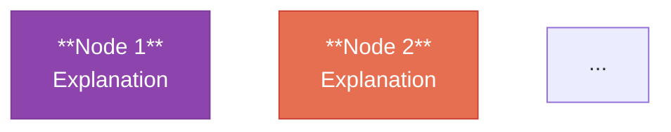

# Output Template

## Complete Note Structure

This template defines the exact assembly order for the final note. Every section is required unless marked optional.

---

```markdown
---
title: "[Conversation Title]"
date: [YYYY-MM-DD]
tags:
  - [tag-1]
  - [tag-2]
  - ...8-20 tags from conversation content
status: raw-synthesis
type: conversation-log
source: "[URL if available]"
related:
  - "[[Related Note 1]]"
  - "[[Related Note 2]]"
  - ...3-10 inferred related notes
---

## 框架圖

![[assets/[Title-Slug]-Framework.svg]]

> [!abstract] Core Thesis
> **[Thesis statement from the framework]**

---

## 第 1 章｜[Chapter Title]

### Troia 講嘅

> [Exact user quote]

### Claude 分析嘅

[Complete, verbatim AI analysis — every paragraph, every list, every code block]

> [!important] 核心命題
> [Key insight — extracted, not paraphrased]

---

[...repeat for each chapter...]

---

## Strategy Cards（第 N 組）

### 🃏 Strategy N｜[Title]

**A) [Question]**

- 🔹 [Option 1]
- 🔹 [Option 2]
- 🔹 [Option 3]

**B) [Question]**

- 🔹 [Option 1]
- 🔹 [Option 2]
- 🔹 [Option 3]

**C) [Question]**

- 🔹 [Option 1]
- 🔹 [Option 2]
- 🔹 [Option 3]

---

[...preserve all Strategy Card groups in conversation order...]

---

## ChatGPT 嘅框架整理（原文保留）

以下係 ChatGPT 喺對話後段自行生成嘅 [type] 嘗試，原文保留：

### Frontmatter（ChatGPT 原版）

```yaml
[exact YAML block from the conversation]
```

### 理論框架圖（ChatGPT 原版 SVG / code）

```[language]
[exact code block from the conversation]
```

> **Core Thesis**
>
> [exact thesis from the conversation]

---

## 理論框架圖（ASCII）

```
[exact ASCII diagram from conversation, if present]
```

---

## 理論框架圖（Mermaid）



---

## 關鍵術語索引

| 術語 | 來源 | 在此框架嘅位置 |
|------|------|----------------|
| **Term** | Origin | Role |

---

## 後續研究行動

- [ ] [Action item with **bold** key terms]
- [ ] ...

---

## 導出方法討論（原文保留）

[Only include if the conversation contains meta-discussion about exporting/archiving]

### Troia 講嘅

> [Exact user quote]

### Claude 分析嘅

[Complete, verbatim AI analysis of export methods]

---

## Strategy Cards（第 M 組 — 導出方法討論中產生）

[Same format as above]

---

> [!quote] 元觀察
> [One paragraph: how this note itself demonstrates the framework discussed in the conversation]

---

*Source: [Platform] Conversation · Organized by Claude Code · [DATE]*
```

---

## Section Placement Rules

| Content Type | Placement | Notes |
|-------------|-----------|-------|
| User quotes | `> blockquote` under `### Troia 講嘅` | Exact text, no trimming |
| AI analysis | Under `### Claude 分析嘅` | Verbatim, including code blocks |
| Code blocks (ASCII, technical) | Inside fenced code blocks | Preserve language tag if present |
| Tables | Markdown table format | Preserve all rows and columns |
| Strategy Cards | Dedicated `## Strategy Cards` section | All options, all fields — even empty |
| SVG code blocks | Under `### 理論框架圖（ChatGPT 原版 SVG）` | Inside fenced code block |
| Key insights | `> [!important] 核心命題` callout | Extracted from analysis, not added |
| Core theses | `> blockquote` or `> [!abstract]` | Original wording |

---

## Callout Types Used

| Callout | Purpose | When to Use |
|---------|---------|-------------|
| `> [!abstract]` | Core thesis of the entire framework | Once, after SVG embed |
| `> [!important]` | Key insight per chapter | Once per chapter (optional) |
| `> [!quote]` | Meta-observation | Once, at the very end |

---

## Source Attribution Format

```markdown
*Source: [Platform] Conversation · Organized by Claude Code · [DATE]*
```

Platform options: ChatGPT, Claude, Gemini, etc.
